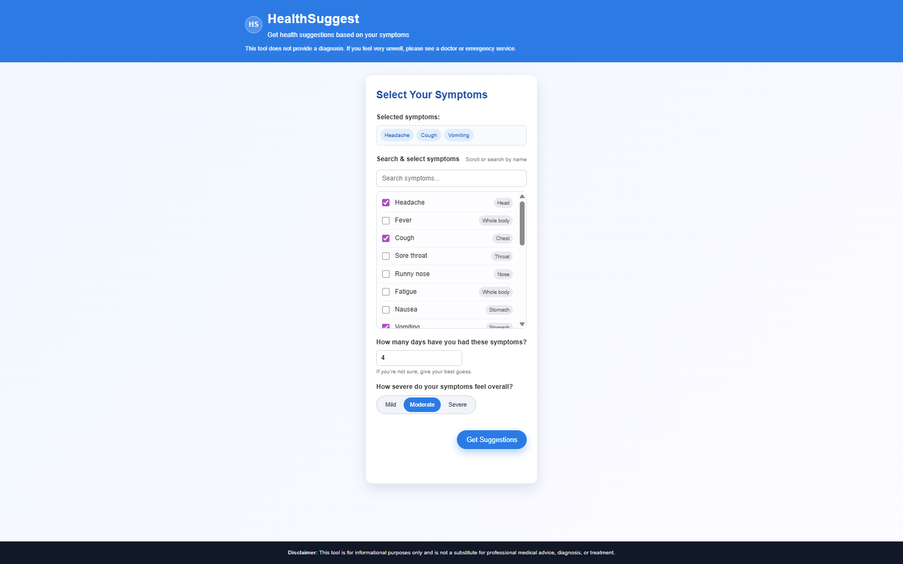
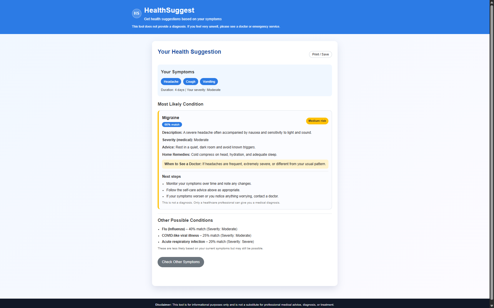

# HealthSuggest

HealthSuggest is a simple Django-based symptom suggestion tool.  
You select symptoms, duration, and how severe you feel, and the app suggests the **most likely condition** plus a short list of **other possible conditions**.  
This is **not a diagnosis tool** and is for informational purposes only.

---

## Features

- Select multiple symptoms from a searchable list
- Enter how many days you’ve had the symptoms
- Choose your own feeling of severity (Mild / Moderate / Severe)
- App calculates:
  - A **best matching condition**
  - **Match percentage** and risk level (Low / Medium / High)
  - A short list of **other possible conditions**
- Clean, mobile-friendly UI with:
  - Selected symptoms shown as chips
  - Highlighted risk badge
  - “Print / Save” button on the result page
- All logic is **rule-based** (no paid APIs)

---

## Screenshots

### Home page – select symptoms



### Results page – suggestion and risk level



---

## Technology stack

- **Backend**: Django (Python)
- **Frontend**: Django templates, CSS (custom)
- **Database**: SQLite (by default) or your chosen DB
- **Environment**: Python 3.x

---

## Getting started (local development)

### 1. Clone the repository

```bash
git clone https://github.com/im-mayankverma/healthsuggest.git
cd healthsuggest
```

### 2. Create a virtual environment

On Windows (Command Prompt or PowerShell):

```bash
python -m venv venv
venv\Scripts\activate
```

### 3. Install dependencies

```bash
pip install -r requirements.txt
```

### 4. Apply migrations

```bash
python manage.py migrate
```

### 5. Create sample data (optional)

In your project folder:

```bash
python manage.py shell
```

Then paste the data seeding script you created earlier (symptoms, conditions, ConditionSymptom mappings) and run it.

### 6. Run the development server

```bash
python manage.py runserver
```

Open your browser and visit:

- http://127.0.0.1:8000/

---

## Project structure (simplified)

```text
manage.py
healthsuggest/          # Django project settings
symptoms/               # Main app
    models.py           # Symptom, Condition, ConditionSymptom
    views.py            # home, get_suggestions logic
    templates/
        symptoms/
            base.html   # Layout, header, footer
            home.html   # Symptom selection form
            results.html# Suggestions and risk view
static/
    css/
        style.css       # Styling for the whole app
docs/
    home-page.png       # Screenshot: home page
    results-page.png    # Screenshot: results page
README.md
requirements.txt
```

---

## Important disclaimer

This project is for **learning and demonstration** only.

It:
- Does **not** provide medical diagnosis.
- Does **not** replace a doctor or emergency service.
- Should **never** be used for real medical decisions.

Always consult a qualified healthcare professional for any health concerns.
